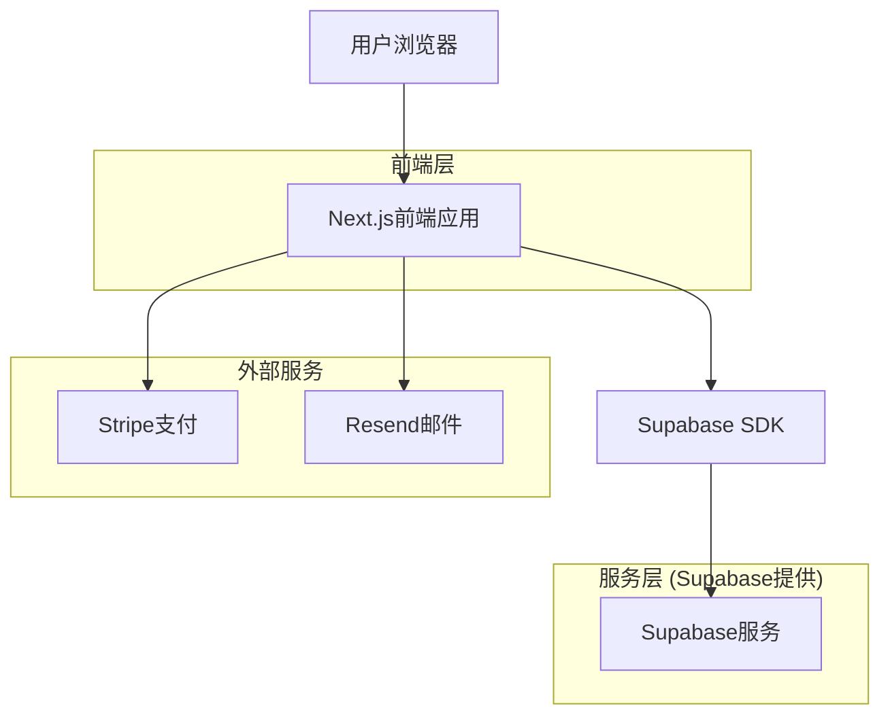
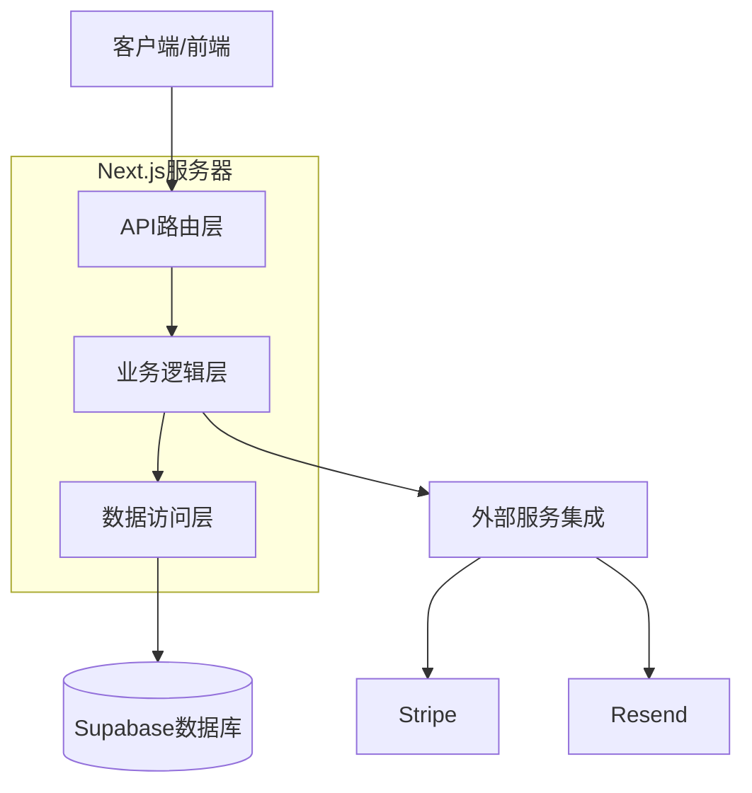
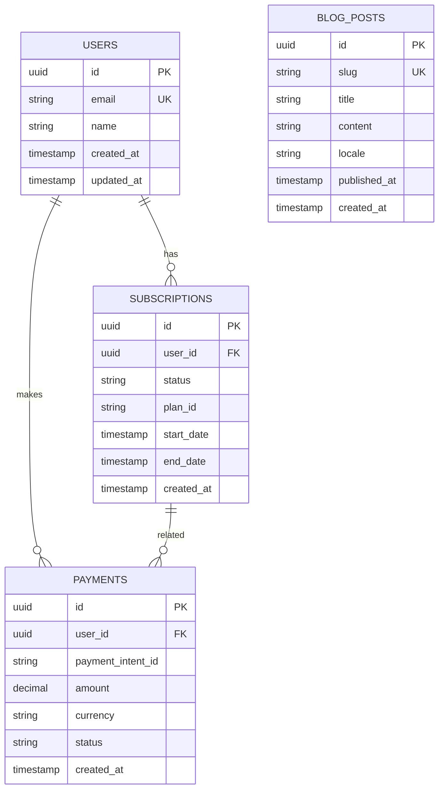

## 1. 架构设计



## 2. 技术描述

- **前端**: Next.js@14 + React@18 + TypeScript + Tailwind CSS
- **初始化工具**: create-next-app
- **后端**: Supabase (认证、数据库、存储)
- **支付**: Stripe集成
- **邮件**: Resend
- **国际化**: next-i18n
- **UI组件**: shadcn/ui + Radix UI

## 3. 路由定义

| 路由 | 用途 |
|------|------|
| / | 首页，展示公司介绍和产品信息 |
| /about | 关于我们页面，公司介绍和联系方式 |
| /product | 产品详情页面，ClipboardShare Pro介绍 |
| /pricing | 定价页面，订阅方案和价格对比 |
| /blog | 博客列表页面，技术文章和更新 |
| /blog/[slug] | 博客详情页面，单篇文章内容 |
| /login | 用户登录页面 |
| /register | 用户注册页面 |
| /dashboard | 用户仪表板，管理订阅和设置 |
| /api/auth/* | 认证相关API路由 |
| /api/payment/* | 支付相关API路由 |

## 4. API定义

### 4.1 核心API

**用户注册**
```
POST /api/auth/register
```

请求参数:
| 参数名 | 参数类型 | 是否必需 | 描述 |
|--------|----------|----------|------|
| email | string | 是 | 用户邮箱地址 |
| password | string | 是 | 用户密码 |
| name | string | 是 | 用户姓名 |

响应:
| 参数名 | 参数类型 | 描述 |
|--------|----------|------|
| success | boolean | 注册状态 |
| user | object | 用户信息 |

**创建支付会话**
```
POST /api/payment/create-checkout-session
```

请求参数:
| 参数名 | 参数类型 | 是否必需 | 描述 |
|--------|----------|----------|------|
| priceId | string | 是 | 价格方案ID |
| successUrl | string | 是 | 支付成功回调URL |
| cancelUrl | string | 是 | 支付取消回调URL |

响应:
| 参数名 | 参数类型 | 描述 |
|--------|----------|------|
| sessionId | string | Stripe会话ID |
| url | string | 支付页面URL |

**获取博客文章**
```
GET /api/blog/posts
```

查询参数:
| 参数名 | 参数类型 | 是否必需 | 描述 |
|--------|----------|----------|------|
| locale | string | 否 | 语言代码 (en/zh) |
| limit | number | 否 | 返回文章数量限制 |
| offset | number | 否 | 分页偏移量 |

响应:
| 参数名 | 参数类型 | 描述 |
|--------|----------|------|
| posts | array | 文章列表 |
| total | number | 文章总数 |

## 5. 服务器架构



## 6. 数据模型

### 6.1 数据模型定义



### 6.2 数据定义语言

**用户表 (users)**
```sql
-- 创建表
CREATE TABLE users (
    id UUID PRIMARY KEY DEFAULT gen_random_uuid(),
    email VARCHAR(255) UNIQUE NOT NULL,
    name VARCHAR(100) NOT NULL,
    created_at TIMESTAMP WITH TIME ZONE DEFAULT NOW(),
    updated_at TIMESTAMP WITH TIME ZONE DEFAULT NOW()
);

-- 创建索引
CREATE INDEX idx_users_email ON users(email);
CREATE INDEX idx_users_created_at ON users(created_at DESC);
```

**订阅表 (subscriptions)**
```sql
-- 创建表
CREATE TABLE subscriptions (
    id UUID PRIMARY KEY DEFAULT gen_random_uuid(),
    user_id UUID REFERENCES users(id) ON DELETE CASCADE,
    status VARCHAR(50) NOT NULL DEFAULT 'active',
    plan_id VARCHAR(100) NOT NULL,
    start_date TIMESTAMP WITH TIME ZONE DEFAULT NOW(),
    end_date TIMESTAMP WITH TIME ZONE,
    created_at TIMESTAMP WITH TIME ZONE DEFAULT NOW(),
    updated_at TIMESTAMP WITH TIME ZONE DEFAULT NOW()
);

-- 创建索引
CREATE INDEX idx_subscriptions_user_id ON subscriptions(user_id);
CREATE INDEX idx_subscriptions_status ON subscriptions(status);
```

**支付记录表 (payments)**
```sql
-- 创建表
CREATE TABLE payments (
    id UUID PRIMARY KEY DEFAULT gen_random_uuid(),
    user_id UUID REFERENCES users(id) ON DELETE CASCADE,
    payment_intent_id VARCHAR(255) UNIQUE NOT NULL,
    amount DECIMAL(10, 2) NOT NULL,
    currency VARCHAR(3) NOT NULL DEFAULT 'USD',
    status VARCHAR(50) NOT NULL,
    created_at TIMESTAMP WITH TIME ZONE DEFAULT NOW()
);

-- 创建索引
CREATE INDEX idx_payments_user_id ON payments(user_id);
CREATE INDEX idx_payments_status ON payments(status);
CREATE INDEX idx_payments_created_at ON payments(created_at DESC);
```

**博客文章表 (blog_posts)**
```sql
-- 创建表
CREATE TABLE blog_posts (
    id UUID PRIMARY KEY DEFAULT gen_random_uuid(),
    slug VARCHAR(255) UNIQUE NOT NULL,
    title VARCHAR(255) NOT NULL,
    content TEXT NOT NULL,
    locale VARCHAR(10) NOT NULL DEFAULT 'en',
    published_at TIMESTAMP WITH TIME ZONE,
    created_at TIMESTAMP WITH TIME ZONE DEFAULT NOW(),
    updated_at TIMESTAMP WITH TIME ZONE DEFAULT NOW()
);

-- 创建索引
CREATE INDEX idx_blog_posts_slug ON blog_posts(slug);
CREATE INDEX idx_blog_posts_locale ON blog_posts(locale);
CREATE INDEX idx_blog_posts_published_at ON blog_posts(published_at DESC);
```

### 6.3 Supabase权限设置

```sql
-- 基本访问权限
GRANT SELECT ON users TO anon;
GRANT SELECT ON blog_posts TO anon;
GRANT SELECT ON subscriptions TO authenticated;
GRANT SELECT ON payments TO authenticated;

-- 认证用户权限
GRANT ALL PRIVILEGES ON users TO authenticated;
GRANT ALL PRIVILEGES ON subscriptions TO authenticated;
GRANT ALL PRIVILEGES ON payments TO authenticated;

-- RLS (Row Level Security) 策略
ALTER TABLE users ENABLE ROW LEVEL SECURITY;
ALTER TABLE subscriptions ENABLE ROW LEVEL SECURITY;
ALTER TABLE payments ENABLE ROW LEVEL SECURITY;

-- 用户只能查看和修改自己的数据
CREATE POLICY "用户只能查看自己的信息" ON users
    FOR SELECT USING (auth.uid() = id);

CREATE POLICY "用户只能查看自己的订阅" ON subscriptions
    FOR SELECT USING (auth.uid() = user_id);

CREATE POLICY "用户只能查看自己的支付记录" ON payments
    FOR SELECT USING (auth.uid() = user_id);
```