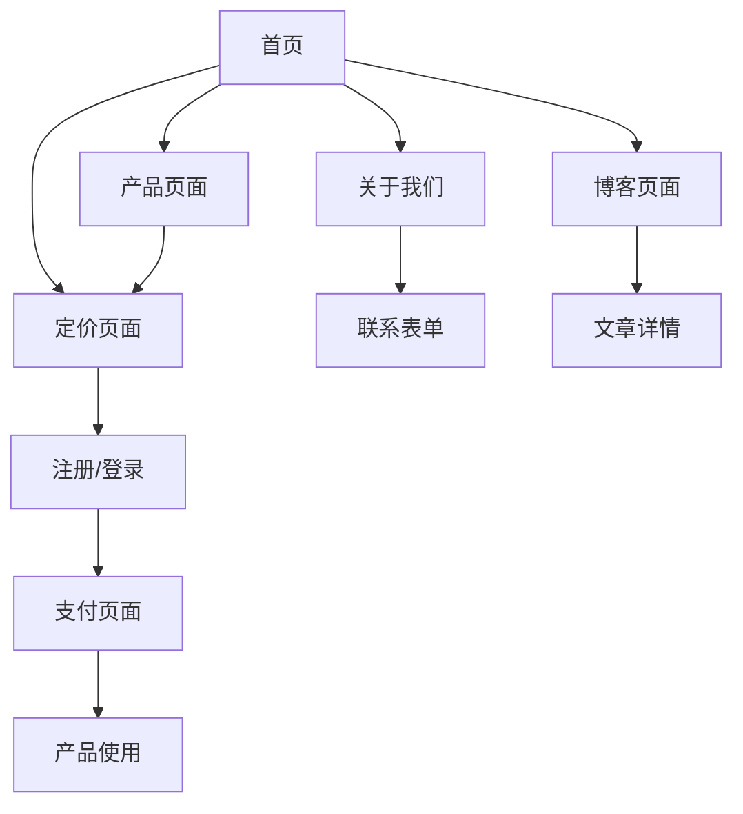

## 1. 产品概述

BitsFactor是一家专注于AI时代工具开发的公司，致力于通过前沿人工智能技术设计和构建实用的、以用户为中心的工具，简化工作流程，消除冗余操作，为个人和企业释放新的生产力潜能。

公司核心使命是赋能用户，提升工作效率，现有产品ClipboardShare Pro支持跨3个以上设备的加密云剪贴板功能。

## 2. 核心功能

### 2.1 用户角色
| 角色 | 注册方式 | 核心权限 |
|------|----------|----------|
| 访客用户 | 无需注册 | 浏览网站内容、了解产品功能、查看定价 |
| 注册用户 | 邮箱注册 | 购买产品、管理订阅、联系客服支持 |
| 付费用户 | 购买订阅 | 使用ClipboardShare Pro全部功能 |

### 2.2 功能模块

BitsFactor营销网站包含以下核心页面：
1. **首页**：公司介绍、核心产品展示、价值主张、行动号召
2. **产品页面**：ClipboardShare Pro详细介绍、功能特性、使用场景
3. **定价页面**：订阅方案、功能对比、购买入口
4. **关于我们**：公司介绍、团队信息、联系方式
5. **博客页面**：技术文章、产品更新、行业洞察

### 2.3 页面详情

| 页面名称 | 模块名称 | 功能描述 |
|----------|----------|----------|
| 首页 | Hero区域 | 展示公司价值主张"AI时代工具开发专家"，包含吸引眼球的标题和副标题 |
| 首页 | 产品展示 | 重点展示ClipboardShare Pro，包含产品截图、核心功能亮点 |
| 首页 | 价值主张 | 阐述如何通过AI技术提升工作效率，解决用户痛点 |
| 首页 | 客户见证 | 展示用户使用产品的成功案例和反馈 |
| 首页 | 行动号召 | 引导用户试用产品或了解更多信息的按钮 |
| 产品页面 | 产品介绍 | 详细介绍ClipboardShare Pro的功能和优势 |
| 产品页面 | 功能特性 | 列出跨设备同步、加密安全、无缝分享等核心功能 |
| 产品页面 | 使用场景 | 展示产品在不同场景下的应用价值 |
| 产品页面 | 快速开始 | 提供产品使用指南和下载入口 |
| 定价页面 | 订阅方案 | 展示不同层级的订阅计划和价格 |
| 定价页面 | 功能对比 | 清晰对比不同方案的功能差异 |
| 定价页面 | 购买流程 | 提供简化的购买和支付流程 |
| 关于我们 | 公司简介 | 介绍BitsFactor的使命、愿景和价值观 |
| 关于我们 | 联系方式 | 提供support@bitsfactor.com邮箱和联系表单 |
| 博客页面 | 文章列表 | 展示技术博客文章列表 |
| 博客页面 | 文章详情 | 显示完整的博客文章内容 |

## 3. 核心流程

### 访客用户流程
访客访问首页 → 了解公司和产品 → 查看定价信息 → 决定购买 → 完成注册和支付 → 成为付费用户

### 注册用户流程
用户注册 → 登录账户 → 选择订阅方案 → 完成支付 → 获得产品访问权限 → 使用产品功能

### 付费用户流程
用户登录 → 访问产品页面 → 下载或使用ClipboardShare Pro → 管理订阅 → 联系客服支持

## 4. 用户界面设计

### 4.1 设计风格
- **主色调**：深蓝色(#1E40AF)体现科技感和专业性，搭配白色背景和灰色辅助色
- **按钮样式**：圆角矩形设计，主要按钮使用渐变色，悬停效果增强交互感
- **字体选择**：主要使用Inter字体，标题使用粗体突出重要性
- **布局风格**：现代化卡片式布局，清晰的视觉层次和信息架构
- **图标风格**：使用简洁的线条图标，保持视觉一致性

### 4.2 页面设计概述

| 页面名称 | 模块名称 | UI元素 |
|----------|----------|--------|
| 首页 | Hero区域 | 大标题使用深蓝色渐变，背景使用轻微的科技纹理，包含醒目的CTA按钮 |
| 首页 | 产品展示 | 使用卡片布局展示产品，每个卡片包含图标、标题、简短描述 |
| 首页 | 价值主张 | 使用三栏布局，图标+标题+描述的格式清晰传达价值 |
| 产品页面 | 功能介绍 | 左右交替的布局展示功能特性，配图增强理解 |
| 定价页面 | 价格卡片 | 使用突出的价格卡片设计，推荐方案特殊标记 |
| 博客页面 | 文章列表 | 简洁的列表设计，包含标题、摘要、发布日期和阅读时间 |

### 4.3 响应式设计
- **桌面优先**：主要针对桌面端用户优化体验
- **移动端适配**：完全适配平板和手机屏幕，保持良好的可读性
- **触摸优化**：按钮和链接适当增大点击区域，便于触摸操作

### 4.4 双语支持
- **中英文切换**：顶部导航提供语言切换选项
- **内容本地化**：所有文案提供中英文版本
- **SEO优化**：针对不同语言版本进行搜索引擎优化